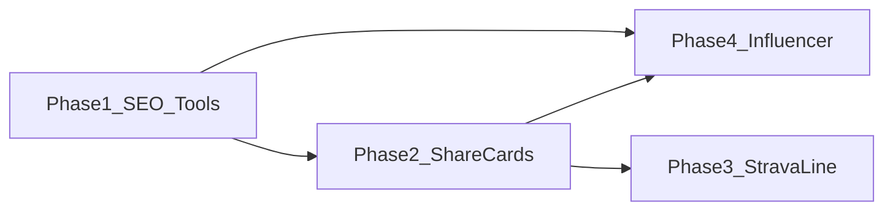

# StrideIQ — Phased Growth Plan (Scoped)

**Status:** Planning document — implementation starts only on **checked approval** below  
**Read first:** [`docs/SESSION_HANDOFF_2026-03-28_GROWTH_AGENT_ONBOARDING.md`](SESSION_HANDOFF_2026-03-28_GROWTH_AGENT_ONBOARDING.md), [`docs/FOUNDER_OPERATING_CONTRACT.md`](FOUNDER_OPERATING_CONTRACT.md)  
**Context:** Phases assume **product-led / automated / user-assisted** growth; founder does not run outbound or personal-brand marketing. Influencer is **Phase 4** only with a **product-first brief** (prior ad-hoc promotion without naming StrideIQ is not treated as a disproof of the channel).

---

## Advisory lineage, research honesty, and independent synthesis

**Lineage (no pretending otherwise).** The three product levers—**shareable finding artifacts**, **Strava-visible distribution**, **SEO around existing free tools**—were articulated in prior advisor/founder conversation before this document. What was added here is **process**: dependency order, per-phase success/kill criteria, global out-of-scope boundaries, OAuth gating, and the **approval checkboxes**. That is **execution architecture**, not a claim of net-new strategic invention.

**What this doc did *not* originally contain (fair critique).** A full **primary** research pass: scraped forum threads, structured competitor teardowns, cohort interviews, or a written evidence appendix with citations. Those remain **follow-up work** if you want the strategy layer to match the rigor of the engineering layer.

**Desk-level patterns (secondary sources / industry common knowledge)** that nevertheless support the *shape* of the plan—not StrideIQ-specific proof:

- **Free-tool / high-intent pages:** Matching calculator-style queries with dedicated landing URLs is a standard bootstrap acquisition pattern for solo products (intent in → value out → optional signup). Organic search typically has **long feedback loops** (often months), so “technical SEO + measurement first” is how you avoid flying blind—consistent with common indie SEO guidance on patience + baseline hygiene.
- **Running category structure:** The market splits roughly between **planner-first** products (simple plans, broad appeal) and **analyst-first** products (depth, metrics, serious amateurs). StrideIQ’s moat is **N=1 intelligence**, not a generic plan PDF—so **shareable proof (Phase 2)** and **credible tool SEO (Phase 1)** align with an **analyst-grade** buyer more than with lifestyle influencer reach alone.
- **Strava as social layer:** Activities and descriptions are a **native distribution surface** for runners; any third-party line must earn trust (opt-in, preview, no spam). That is product judgment + API policy discipline, not a novel claim.

**Independent synthesis (StrideIQ-specific, not generic SaaS):**

- The natural “viral unit” for a **correlation-engine** product is not a generic tip graphic—it is **evidence**: a defensible, already-suppressed finding the athlete is willing to attach their name to. That is why Phase 2 is tied to **Manual/briefing** truth, not marketing copy.
- **Phase 1 before Phase 2 (measurement):** Instrumenting tool → CTA → account creation means when cards ship, you can separate “sharing works” from “landing pages convert”—otherwise Phase 2 success is **unattributable noise**.

**Recorded advisor recommendation (for founder decision):** Approve **Phase 1 only** first. Reassess after the **90-day** window in Phase 1. If organic tool traffic is flat, **do not** assume SEO failed in isolation—tighten queries, copy, and internal links—but **do** elevate Phase 2 as the next bet regardless, with telemetry already live. Phase 2 remains the **distribution unlock**; Phase 1 is the **instrumentation unlock**.

---

## Initiative scope (founder approval)

This block is the **control surface**. Agents implement **only phases you mark**. Everything else stays documentation.

### What this initiative covers (when approved)

| Phase | One-line scope | Requires |
|-------|----------------|----------|
| **1** | SEO + technical discoverability for existing free tools (`apps/web/app/tools/**`), internal links, sitemap/robots check, tool-funnel **measurement** (telemetry events as specified in Phase 1) | Nothing beyond normal web deploy |
| **2** | Shareable **image cards** for trust-safe findings (Manual / briefing surfaces), Web Share / download, branding + link, telemetry | Phase 1 **recommended** first; trust review |
| **3** | Opt-in **Strava activity description** one-liner + preview | **Separate founder approval** for any **new OAuth scope** (e.g. `activity:write`), relink UX, Strava policy alignment — see [`FOUNDER_OPERATING_CONTRACT.md`](FOUNDER_OPERATING_CONTRACT.md) |
| **4** | **Process only:** brief, creator fit criteria, 1–2 pilot outreach, UTM + metrics; no retainer / spend without separate approval | Phase 1 **minimum**; Phase 2 **strongly preferred** |

### Global in scope (any approved phase)

- Changes under **`apps/web`** (landing, tools, metadata, components supporting share UI).
- **`apps/api`** only where needed for Phase 2–3 (e.g. share payload, Strava post path) — scoped commits, no unrelated refactors.
- **First-party telemetry** definitions and events; no third-party analytics.
- **Docs** updates for shipped behavior (SITE_AUDIT, optional session handoff).

### Global out of scope (entire initiative)

- Paid acquisition, influencer **contracts or spend** without explicit separate approval.
- New **blog / content calendar** as the primary growth lever.
- **Onboarding flow rewrites** framed as growth (traffic is the bottleneck).
- Founder **outbound**, community management, or personal-brand campaigns.
- **OAuth / API permission expansion** without explicit founder approval (binding contract).

### Approve phases (check to authorize build work)

Fill in when you are ready for agents to implement.

- [ ] **Phase 1** — SEO + tools funnel + measurement  
- [ ] **Phase 2** — Shareable finding cards  
- [ ] **Phase 3** — Strava line *(OAuth scope approval recorded separately)*  
- [ ] **Phase 4** — Influencer pilot *(process + 1–2 contacts; no scaled spend)*  

**Suggested first cut (advisor, non-binding):** Phase 1 only — instrumentation before betting heavily on Phase 2; see **Advisory lineage, research honesty, and independent synthesis** above.

**If none are checked:** no implementation; planning and research only.

**Approval record**

| Field | Value |
|-------|--------|
| Date | |
| Phases approved | (e.g. 1 only, or 1–2) |
| Notes | |
| Founder sign-off | |

---

## Phase dependency (order)

- **Phase 4** should not run before **Phase 1** at minimum: influencers need a sharp URL and, ideally, shareable proof.  
- **Phase 3** (Strava) can ship after **Phase 2** so “what to say” in the line is grounded in real, shareable findings—not generic text.

---

## Phase 1 — Search intent and tool funnel

**Objective:** Capture runners who already search for calculators and pacing help; move them from anonymous tool use toward signup/trial with clear, honest positioning.

### In scope

- **Metadata and structure:** Unique `title` / `description` / Open Graph per high-value routes; canonical URLs; consistent H1 + short runner-native intro copy where missing (`apps/web/app/tools/**`, `apps/web/app/tools/page.tsx`).
- **Internal linking:** From landing (`page.tsx`, `FreeTools`, `Hero`) and between related tools (pace ↔ BQ ↔ heat ↔ equivalency) so crawlers and users see a coherent “free tools” cluster.
- **Technical SEO baseline:** `sitemap.xml` / `robots.txt` review if present; ensure tool routes are included and not accidentally noindexed.
- **Measurement:** UTM convention for any manual link-outs later; first-party telemetry already in place — define **events** for tool page view, CTA click, signup start (see [`apps/web/lib/hooks/usePageTracking.ts`](../apps/web/lib/hooks/usePageTracking.ts), [`apps/api/routers/telemetry.py`](../apps/api/routers/telemetry.py)) so Phase 1 success is measurable without third-party analytics.

### Out of scope

- A new blog or content calendar.
- Paid ads.
- Rewriting onboarding flows (traffic is the bottleneck, not onboarding copy for unseen users).

### Deliverables (checklist)

1. Inventory of all public tool URLs (including dynamic segments) with target queries per page.  
2. Metadata + copy pass per route cluster (minimum: index + one exemplar sub-route per calculator).  
3. Internal linking map (10–20 intentional links).  
4. Documented primary metrics and review cadence (e.g. weekly: tool views, CTA clicks, new accounts).

### Dependencies

- None (uses existing Next.js app and tools).

### Success / kill criteria (90 days)

- **Proceed:** Meaningful upward movement in **tool → signup** rate or **branded/niche organic** sessions (even small N), with stable Core Web Vitals.  
- **Reassess:** Zero movement after technical fixes + copy pass; shift effort to Phase 2 artifacts driving direct referral.

### Effort (order of magnitude)

- **Small–medium:** Mostly web app + sitemap; 1–2 focused iterations with agents.

### Risks

- SEO lag; success is judged on **leading** indicators (impressions/clicks) early, conversions as data arrives.

---

## Phase 2 — Shareable finding cards

**Objective:** Turn confirmed N=1 outputs (Manual, briefing, high-trust findings) into **one-tap share images** with StrideIQ branding and a link—distribution as a side effect of value.

### In scope

- **Surface selection:** Which finding types are allowed (e.g. from Personal Operating Manual V2, morning briefing) with **Athlete Trust Safety** and suppression rules unchanged — only share what the product would already show (`apps/api/services/operating_manual.py`, [`apps/web/app/manual/page.tsx`](../apps/web/app/manual/page.tsx), home briefing paths).
- **UI:** “Share” on a vetted finding → generate image (client canvas or server image API) + Web Share API / download, pattern aligned with Runtoon ([`apps/web/components/runtoon/`](../apps/web/components/runtoon/), [`apps/api/routers/runtoon.py`](../apps/api/routers/runtoon.py) as reference for share flow).
- **Brand:** Fixed footer: product name + URL; optional short finding headline + “confirmed N times” if present in data.
- **Telemetry:** Share initiated, share completed, destination if available.

### Out of scope

- Sharing raw activity data or anything that violates privacy or trust contract.
- Auto-posting to social networks without explicit user action.

### Deliverables

1. Spec: allowed finding types + redaction rules.  
2. Card design (one mobile aspect ratio first).  
3. API or client pipeline for image generation + stable share URL (landing with UTM).  
4. Manual + home integration points (start with one surface if needed for scope control).

### Dependencies

- Phase 1 **nice-to-have** for landing URL quality when new users arrive from a card; not blocking MVP share.

### Success / kill criteria (90 days)

- **Proceed:** Non-zero shares/week with measurable **incoming visits** or signups attributed (UTM/ref).  
- **Kill:** Shares happen but zero downstream traffic—iterate card CTA and landing before building more surfaces.

### Effort

- **Medium:** New UX + image pipeline + trust review.

### Risks

- Over-sharing weak findings; mitigate with strict eligibility and copy review.

---

## Phase 3 — Strava activity description line (opt-in)

**Objective:** Optional one-line insight appended to the athlete’s **Strava activity description** so followers see StrideIQ in context—passive distribution to 50–500 follower lists per user.

### In scope

- **OAuth:** Request `activity:write` (and document why) — extend [`apps/api/services/strava_service.py`](../apps/api/services/strava_service.py), [`apps/api/routers/strava.py`](../apps/api/routers/strava.py); migration/relink flow for existing Strava users.
- **Product rules:** Opt-in toggle; frequency cap (e.g. max once per activity or only when a “shareable” insight exists); user preview before upload; **athlete approves** final text.
- **Content:** Short, non-spammy line referencing StrideIQ + link; must respect trust/suppression (no directional medical claims).
- **Failure handling:** Strava API errors, rate limits, rollback.

### Out of scope

- Silent posting without preview.
- Posting for users who have not connected Strava or granted write scope.

### Deliverables

1. Scope change documentation and consent copy.  
2. Settings UI + preview + post path.  
3. Server job or synchronous post after activity sync (architecture TBD against existing Celery/sync).  
4. Metrics: opt-in rate, posts succeeded, click-through.

### Dependencies

- **Phase 2 strongly recommended** so the “line” can mirror real finding quality, not generic marketing.

### Success / kill criteria (90 days)

- **Proceed:** Healthy opt-in among Strava users + non-zero link clicks from Strava referrers.  
- **Kill:** Strava rejects, users churn, or support burden exceeds value—disable feature flag.

### Effort

- **Medium–large:** OAuth relink, API surface, compliance with Strava brand/API policies.

### Risks

- Strava policy and user perception (“spam”); mitigate with opt-in, preview, caps, and elite copy discipline.

---

## Phase 4 — Product-led influencer experiments

**Objective:** Run **1–2 controlled tests** where the **product** is the story (Garmin + Strava, depth of history, N=1 findings), not founder celebrity. Corrects earlier “influencer failed” conflation: prior promotion did not name StrideIQ or target product-fit audiences.

### In scope

- **Creator fit:** Garmin-native or platform-agnostic “data / coaching / serious runner” micro-creators; avoid **watch-brand-exclusive** partnerships where the audience identity conflicts with “connect Garmin” (understanding COROS etc. as positioning friction, not moral judgment).
- **Brief:** Screen-led demo: connect → insight within minutes; CTA to strideiq.run with **UTM**; clear disclosure if gifted access.
- **Measurement:** Trials, connects, not follower counts; compare to baseline weeks.

### Out of scope

- Large spend or long-term ambassador deals before Phase 1–2 proof.
- Creators whose primary asset is **lifestyle** with no alignment to data depth.

### Deliverables

1. One-page brief (messaging dos/don’ts, legal/disclosure, metrics).  
2. Shortlist of 5–15 candidates and selection criteria.  
3. Post-mortem template (what worked, what didn’t, kill decision).

### Dependencies

- **Phase 1** live (landing + tools credible).  
- **Phase 2** strongly preferred (shareable proof creators can point to).

### Success / kill criteria (90 days)

- **Proceed:** Cost-per-qualified-signup or connect beats a defined threshold vs organic baseline.  
- **Kill:** Views without product actions—do not scale; revert to organic + product loops only.

### Effort

- **Low execution time, high coordination:** Mostly founder time + one outreach cycle; optional small access/gift cost.

### Risks

- Mismatch (audience wants simplicity, product is depth); brief must qualify viewers up front.

---

## Summary table

| Phase | Focus                         | Primary metric              | Build heaviest?      |
|-------|-------------------------------|-----------------------------|-------------------------|
| 1     | SEO + tools + telemetry hooks | Tool → signup / organic CTR | Web + sitemap           |
| 2     | Shareable finding cards       | Shares → site visits        | Web + API + design      |
| 3     | Strava description line       | Opt-in, posts, referrals    | API + OAuth + settings  |
| 4     | Influencer (product-first)    | Connects / trials (UTM)     | Process + brief         |

---

## Document maintenance

When a phase ships or is cancelled, update this file (status line + date). Optional: link from [`SESSION_HANDOFF_2026-03-28_GROWTH_AGENT_ONBOARDING.md`](SESSION_HANDOFF_2026-03-28_GROWTH_AGENT_ONBOARDING.md) Part 4 as the canonical phased plan.
